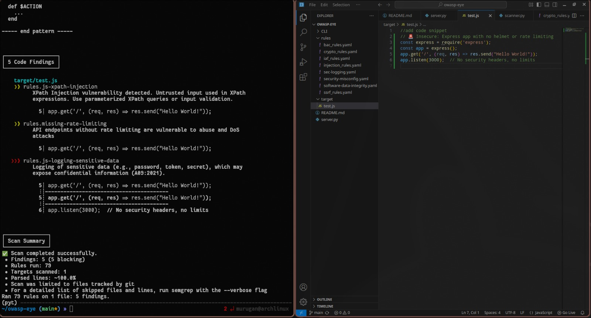
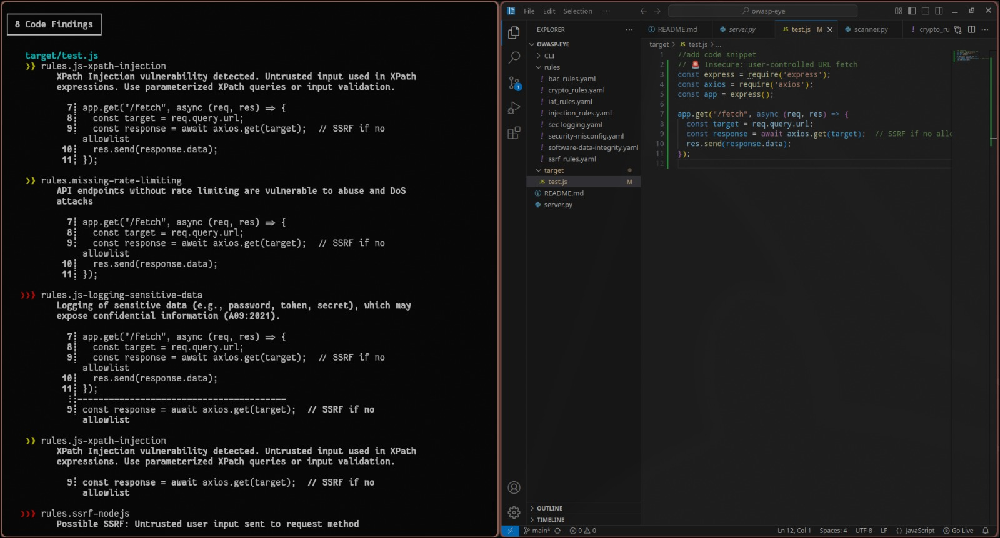
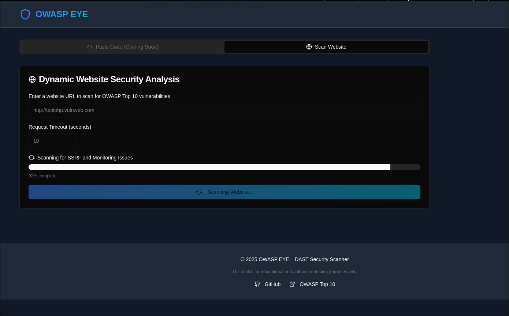
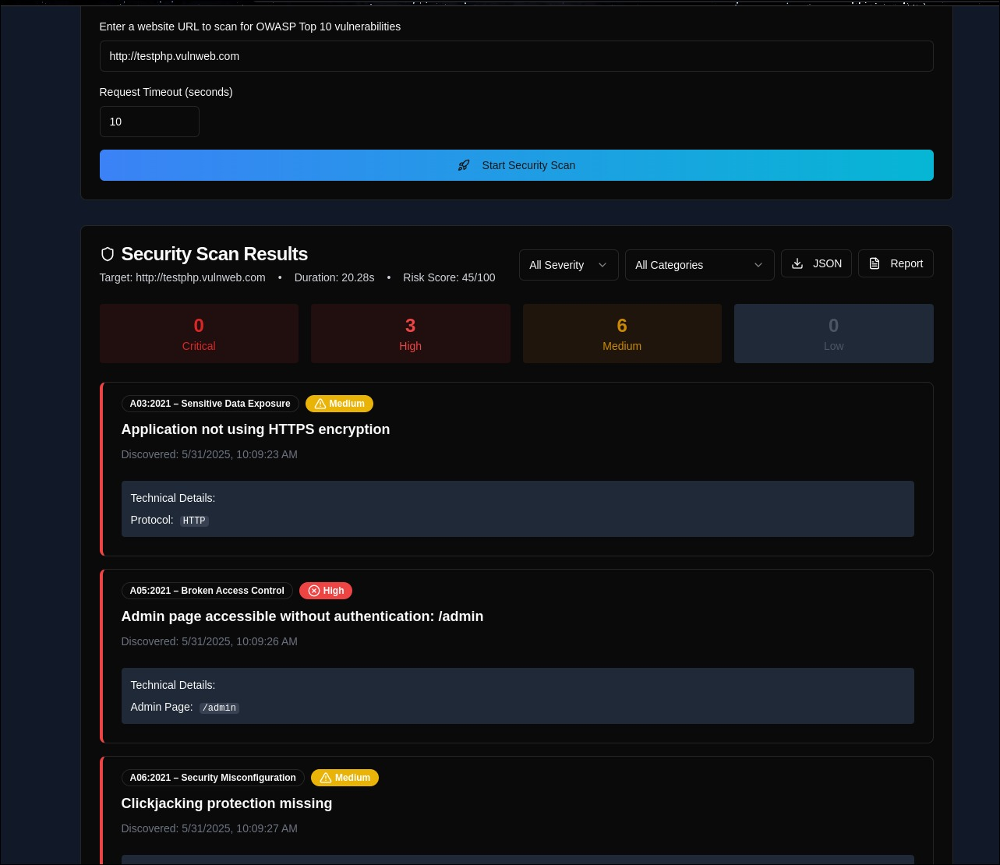

# 🛡️ OWASP Eye

OWASP Eye is a lightweight, browser-accessible vulnerability scanner designed to help developers and students learn secure coding practices through hands-on static and dynamic analysis. The tool focuses on identifying vulnerabilities aligned with the OWASP Top 10 in frontend web code and deployed web applications.

---
 
## 📌 Project Highlights

- **Scans HTML/JavaScript snippets and live web URLs**
- **Aligned with OWASP Top 10 vulnerabilities**
- **Fully browser-based static analysis with optional dynamic testing backend**
- **Beginner-friendly interface designed for educational use**
- **Modular rule engine using Semgrep for extensibility**

---

## 🚀 Features

- **🧩 OWASP Top 10 Detection**  
  Detects issues like Cross-Site Scripting (XSS), Injections, Broken Access Control, and Security Misconfigurations.

- **📄 Snippet-Based Static Analysis**  
  Scans HTML/JavaScript code snippets in-browser for client-side vulnerabilities using rule-based matching.

- **🌐 Dynamic URL Scanning**  
  Allows testing of live web URLs for misconfigured headers, insecure CORS policies, and exposed endpoints.

- **🖥️ Browser-Based Interface**  
  No setup required for static analysis—runs fully on the client side for privacy and accessibility.

- **⚙️ Customizable Rule Engine**  
  Built on Semgrep, the tool uses extensible rule sets mapped to the OWASP Top 10 categories.

---

## 🏗️ Technical Architecture

### Frontend
- Built using **React** for a fast and responsive interface.
- Users can submit code snippets or URLs for analysis.

### Backend (for dynamic testing)
- Developed using **Python Flask**
- Performs:
  - Response header analysis (e.g., CSP, X-Frame-Options)
  - CORS policy inspection
  - Basic simulation of attack vectors

### Static Analysis
- Uses **Semgrep** to perform pattern-based scanning of HTML/JS snippets.
- Identifies unsafe code usage like:
  - `innerHTML`, `document.write` (DOM XSS)
  - Missing security headers
  - Open redirects

### Security Libraries
- **DOMPurify** for demo-based XSS mitigation
- **Acorn.js** for JavaScript parsing
- **CORS Anywhere** (during development) to simulate CORS scenarios

---

## Requirements

- Python 3+
- Flask
- semgrep

## Installation if running locally

1. Clone the repository

```bash
    git clone https://github.com/murugnn/owasp-eye.git
    cd owasp-eye 
```

2. Install the required dependencies

```bash
    pip install -r requirements.txt
```

## Local Usage
You can perform both SAST and DAST from the terminal locally


### For SAST

Install semgrep. You should have it already if you installed all the dependencies in `requirements.txt`

Place the source codes you want to test in the folder `target/`

Open a terminal and execute the following command

```bash
    semgrep --config=rules/ target/
```

Semgrep will go through the code, checking for any matches without our ccustom ruleset of vulnerability patterns, and will show any possible errors

### For DAST

```
# Basic scan
python scanner.py http://example.com

# With custom timeout
python scanner.py http://example.com --timeout 15
```


## Usage on web

### Backend server
In the root folder
```bash
  pip install -r requirements.txt
  python server.py
```

### Frontend
```bash
  cd frontend
  npm install --legacy-peer-deps
  npm run dev
```

The frontend will be hostel at `http://localhost:3000`

## 🧪 Testing and Validation

- Functional prototype with working snippet scanner
- Dynamic tester validated with sample URLs and insecure headers
- Rule-based detection confirmed with common insecure code patterns

---
 
 ## Command-line Testing

 

 

 ---

 ## UI Overview

 

 

 ---

## 🔮 Scalability & Future Enhancements

- Add support for server-side languages (Python, PHP, Node.js)
- Enable upload-based scanning (GitHub repo or ZIP)
- Build gamified learning modules for CTF training
- Launch PWA version for mobile accessibility
- Add user accounts for progress tracking and scan history

---

## 👥 Team

**Team Name:** Stardust Crusaders  

---

## 📢 Call to Action

OWASP Eye is an open, educational tool that empowers students and developers to build more secure web applications from the ground up. Whether you're an instructor, learner, or contributor, we invite you to explore, use, and improve OWASP Eye to help make the web safer for everyone.

---

## 📄 License

This project is open-source and available under the [MIT License](LICENSE).

